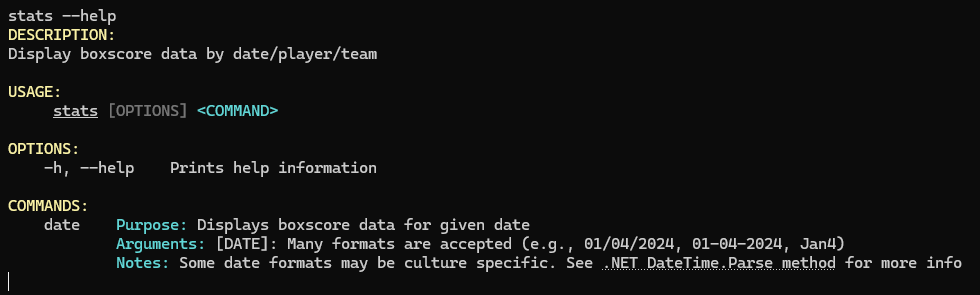
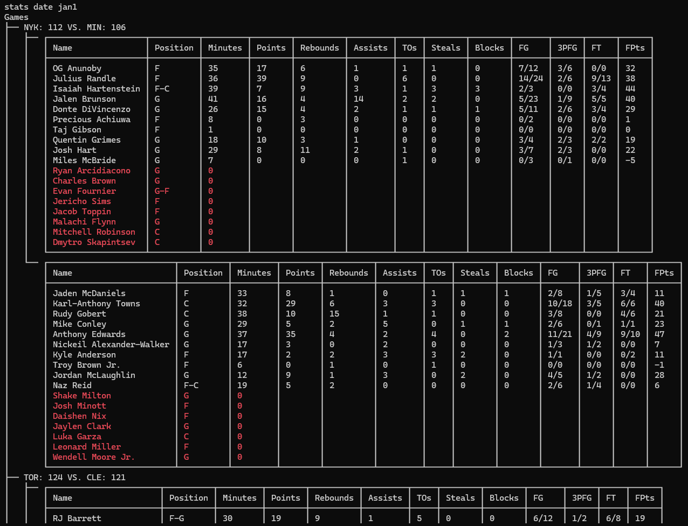

# Hoops Helper

## About
Hoops Helper is a console application that retrieves a variety of NBA data, it is designed to be particularly useful for fantasy basketball.

The application is meant to be a resource that provides all the data necessary for making fantasy basketball decisions, rather than being an application that makes recommendations/decisions for you.
The aim is to provide insights and statistics that may ordinarily require multiple sources to collect, and make them all conveniently queryable via one simple console application.
What you do with the information up to you, savvy manager (and isn't that half the fun, after all).

The application is currently in very early stages, with relatively few features, more features will become available in the coming weeks and months.

## Features

### Current Features
- Display player statistics (major stat categories) for all games of a given date in the current NBA season, including:
  - Player fantasy points[^1]
  - Injured and inactive players

[^1]: Currently ESPN's default fantasy points for points leagues is used. Custom configuration will be available down the road

### Planned Features
- Display player statistics for previous X games of a given team
- Display statistics for the previous X games of a given player
- Valuable insights on team schedules
  - Teams that play few/many games in a given week
  - Teams with back to backs
- Connection to your specific fantasy league
  - Insights/filtered searches of available players

## Setup

In order for the application to work, you will need to create a free account with the [BALLDONTLIE API](https://www.balldontlie.io/)
and obtain your personal API key (this is where the application fetches its NBA data).
Once you do this, you'll have to create an _environment variable_ on your machine titled 'NBA_API_KEY'.

### Windows
1. Navigate to 'Advanced System Settings' via 'Control Panel > System' or 'Settings > System > About'.
2. Select 'Environment Variables'
3. Under 'System Variables' select 'New'
4. Name the new variable 'NBA_API_KEY' with a value of your personal API key
5. Verify your environment variable by launching a CMD session and executing `echo %NBA_API_KEY`. Your API key should be displayed to you.

### Mac or Linux
1. Open ~/.bashrc in a text editor
2. At the bottom of the file add the following: `export NBA_API_KEY=[YOUR_KEY]` replacing [YOUR_KEY] with your personal API key.
3. Save changes to the file
4. Run the following command in terminal `source ~/.bash-profile`
5. Verify your environment variable by executing `echo $NBA_API_KEY`. Your API key should be displayed to you.

## Installation

Hoops Helper has not yet been released as a standalone executable. For now the application must be built from source as follows:

__Prerequisites__: .NET 8.0+ which can be installed [here](https://dotnet.microsoft.com/download/dotnet).

The following steps should be executed within a command line environment.

__Step 1__: Clone the repository: `git clone https://github.com/noahmacaskill/HoopsHelper`

__Step 2__: Navigate to the project directory.

__Step 3__: Build the application: `dotnet build`

__Step 4__: Run the application: `dotnet run`

And you should be good to go!

## Usage

For help with using the application, simply type '--help' or '-h'. The help option can be called on any command for more information on its usage:

### Stats Command
The stats command generates player data, including major stat categories and fantasy points, given a specific date, team, or player.
A subcommand of stats must be specified, one of date, player or team[^2].

__Date__: `stats date [DATE]` provides player data for all games played on the given date.
E.g. `stats date jan1`. Many date formats are accepted.

[^2]: Player and team commands not yet implemented

## Acknowledgements
The pretty, well structured outputs, as well as the handling of user arguments were made possible by [Spectre.Console](https://github.com/spectreconsole/spectre.console).
All NBA data is retrieved using the [BALLDONTLIE API](https://www.balldontlie.io/).

Thank you to them both for making this project possible!

